# 🛡️ ENCRA: Advanced Secure File Distribution

**ENCRA** is a state-of-the-art secure file sharing and distribution system designed for high-stakes sensitive data. It combines multi-layer military-grade encryption with persistent behavioral monitoring and automated "Burn-on-Read" (BoR) protocols to ensure your data remains protected even after it reaches its destination.

---

## 🚀 Key Features

- **⛓️ Multi-Layer Encryption**: Chain multiple encryption algorithms (AES-256, Blowfish, TripleDES, Fernet) to create a "Defense in Depth" barrier.
- **👁️ Burn-on-Read (BoR)**: Secure links that automatically incinerate all data (encrypted file, metadata, and QR code) after a single successful view.
- **🛡️ Integrity Protection**: HMAC-SHA256 signatures ensure that even a single bit change in the encrypted file triggers a system-wide security alert and immediate data destruction.
- **🚨 Behavioral Sentinel**: Real-time monitoring for suspicious activities:
    - **Tamper Detection**: Detects manual file alterations.
    - **Leaking Prevention**: Monitoring for copy/paste attempts and browser visibility changes.
    - **Brute Force Protection**: Automatic "Self-Destruct" after 3 failed password attempts.
    - **📸 Vision Shield (Camera Guard)**: Continuous camera-based monitoring:
        - **Abnormal Light Detection**: Triggers an alert if suspicious lighting changes are detected (e.g., flash use).
        - **Light Blockage Detection**: Detects physical obstruction of the camera (potentially indicating an attempt to hide a recording device or physical tampering).

- **📊 Proof Mode Dashboard**: Comprehensive audit logs and cryptographic evidence for every file shared, including IP forensics and geolocation (ISP/City/Country).
- **📧 Automated Distribution**: Integrated secure email delivery with one-time-use QR codes.

---

## 🛠️ Technical Architecture

ENCRA uses a sophisticated lifecycle for file security:

```mermaid
graph TD
    A[Upload File] --> B[Generate Master Salt & Integrity Key]
    B --> C[Layered Encryption: Fernet/AES/BF/TDES]
    C --> D[Generate HMAC-SHA256 Signature]
    D --> E[Store Metadata & Encrypted Blob]
    E --> F[Generate One-Time QR Code]
    F --> G[Email to Receiver]
    G --> H{Receiver Access}
    H -->|3 Failures| I[🔥 AUTO-DESTRUCT]
    H -->|Verify Password| J[Temporary Decryption]
    J --> K[Real-time Monitoring]
    K -->|Viewed| L[🔥 BURN-ON-READ]
    K -->|Tamper Detected| I
```



### Stack
- **Backend**: Flask (Python)
- **Security**: Flask-Talisman (CSP/HSTS), Flask-Limiter (Rate Limiting), Flask-WTF (CSRF)
- **Cryptography**: `cryptography` (Fernet), `pycryptodome` (AES, Blowfish, 3DES)
- **Forensics**: `requests` (IP Geolocation API)

---

## 📦 Installation & Setup

### 1. Clone the Repository
```bash
git clone https://github.com/yourusername/encra.git
cd encra
```

### 2. Install Dependencies
```bash
pip install -r requirements.txt
```

### 3. Environment Configuration
Create a `.env` file (or set environment variables):
```env
SECRET_KEY=your_secure_flask_key
SMTP_EMAIL=securefileencra@gmail.com
SMTP_PASSWORD=your_app_password
```

### 4. Run the Secure Server
ENCRA requires HTTPS. It runs with an ad-hoc SSL context by default for development.
```bash
python app.py
```
Visit `https://localhost:5050` (Accept the self-signed certificate warning).

---

## 🔒 Security Protocols

### One-Time Tokenization
ENCRA generates a **Secure Raw Token** used only in the URL/QR code. This token is hashed using SHA-256 before being stored in the database. Even if the database is compromised, an attacker cannot reverse the hash to obtain the access URL.

### 📸 Vision Shield & Light Monitoring
The client-side "Vision Shield" utilizes the user's camera to maintain environmental awareness:
- **Light Blockage**: The system analyzes luminance levels. A sudden, sustained drop in light levels (blockage) triggers an immediate **CONTENT_DESTROYED** event, assuming the camera is being physically covered or tampered with.
- **Physical Recording Prevention**: By detecting abnormal light fluctuations (such as those caused by a second screen or camera flash), the system protects against external "analog hole" recording attempts.

### Persistent Forensics
Every interaction is logged in `security_alerts.log`. The **Proof Dashboard** provides:
- **Timestamped Events**: Creation, Opening, Verification, Viewing, Destruction.
- **Client Metadata**: Parsed User-Agent, ISP, City, and Country.
- **Cryptographic Proof**: Hashes of the original vs. encrypted content.

---

## 📜 License
This project is licensed under the MIT License - see the LICENSE file for details.

> [!WARNING]
> **ENCRA** is a security tool. Configuration of the SMTP service and secret keys is critical for production safety. Always deploy behind a production-grade WSGI server like Gunicorn or Nginx with a valid SSL certificate.
